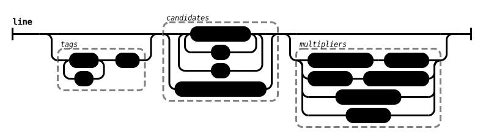

# PrefVote support of Condorcet Election Format (CEF) input files

PrefVote interprets files named like \*.cvotes as [Condorcet Election Format (CEF)](https://github.com/CondorcetVote/CondorcetElectionFormat#invalid). CEF was developed as a common input file format intended to be supported by voting systems using Condorcet-compatible methods.

## CEF parameter lines and comments

Comments start with a '#'. They do not have to be at the beginning of the line. No further parsing of the line is done after the start of a comment.

CEF parameter lines begin with "#/" followed by the name of the parameter, a colon ':', and the value of the parameter.

The CEF file begins with parameter lines at the top.
These must all occur before the first vote line.

### #/Candidates:

Semicolon-delimited list of names of choices/candidates in the election.

This is optional, but recommended. If not specified, the candidates will be collected from ballot lines. It is recommended to specify valid candidates so that invalid candidates can be recognized.

### #/Number of Seats:

Integer value with the number of seats available for election or selection. In other words, this is how many winners are allowed in the voting results.

This is optional. If not specified, PrefVote sets the number of seats to zero, which ranks all the candidates in order of voting results without mentioning a number of winners. This differs from the CEF definition which sets an arbitrary integer 100 for the number of seats, intended to be more than the number of candidates in most elections. In effect, both achieve similar results of ranking all the candidates.

### #/Implicit Ranking:

Boolean "true" or "false" value, if set, signals that choices/candidates omitted from a ballot get ranked into last place.

This is optional. The default value is true. It is recommended to set this to true (which happens by default). The setting can make a difference in voting results and is important to be aware which setting is in use.

### #/Voting Methods:

Semicolon-delimited list of names of voting methods allowed for processing the election.

This can also be specified by the singular-form alias "#/Voting Method:".

This is optional. CEF provides no default value and leaves that decision to the underlying voting system. PrefVote usually requires a voting method via the YAML or direct-API calls. For processing CEF, PrefVote uses a default value of RankedPairs.

### #/Weight Allowed:

Boolean "true" or "false" value, if set, signals that weights are allowed on votes. When weights are not allowed or not specified, they have a weight multiplier of 1.

The default value is false. Specifying a weight (with the "^" operator) when the "Weight Allowed" parameter is not set is considered by PrefVote to be an error and results in rejection of any such ballot line as invalid.

## CEF vote lines: syntax diagrams and ABNF definitions

Following the parameters are vote lines. No more parameters are allowed after the first vote line.

Vote lines may represent individual ballots with a quantifier of 1, or ballots which all had the same content and a quantifier indicating how many identical-pattern ballots were aggregated into one line.

Syntax diagrams and
[Augmented Backus–Naur Form (ABNF)](https://en.wikipedia.org/wiki/Augmented_Backus%E2%80%93Naur_form)
(see [Internet Standard 68 / RFC 5234](https://tools.ietf.org/html/std68)) define how to parse lines of CEF votes.

### tokens

    TAGDELIM = "||"

    EMPTY_RANKING = "/EMPTY_RANKING/"

    INT = 1*DIGIT

    WORD = 1*( ALPHA / DIGIT / "_" / "!" / "$" / "%" / "&" / "+" / "." / ":" / ";" / "@" / "-" )

### words

    words = 1*( WORD / INT )

### candidate

    candidate = words

### quantifier

    quantifier = "*" INT

### weight

    weight = "^" INT

### tag 

    tag = words

### line

PrefVote differs from the official CEF definition in parsing multipliers (quantifier and/or weight) in any order, as long as each appears no more than once. For CEF files which strictly follow the official definition, when both are specified then the weight must be first, followed by the quantifier. PrefVote will not consider it an error if quantifier is followed by weight.

    tags = tags "," tag
	tags =/ tag

    multipliers = quantifier weight
    multipliers =/ weight quantifier
    multipliers =/ quantifier
    multipliers =/ weight

    ranking = choice_list 0*1multipliers
    ranking =/ EMPTY_RANKING 0*1multipliers

    line = tags TAGDELIM ranking
    line =/ ranking

