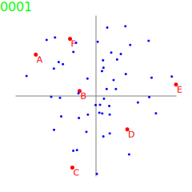
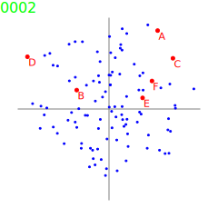
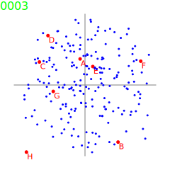
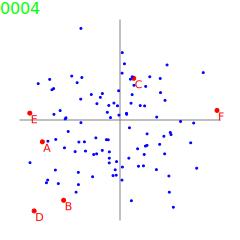

# PrefVote test suite

PrefVote is designed for multiple programming language implementations using a common test suite. The test suite consists of "black box" test specs used across all languages, plus "white box" unit tests within each language's source code directory. The test harness collects [Test Anything Protocol (TAP)](https://testanything.org/) data from each language's unit tests to report the results.

*Current status:* The reference implementation is in Perl, and takes advantage of TAP (Test Anywhere Protocol) which originally started with Perl unit-testing system developers. PrefVote in Perl has extensive whitebox tests. And the blackbox tests for all (future) language implementations is in Perl. The next planned language implementations will be Rust and Python.

## Scripts in the test directory

* acr-compare: comparison of voting methods with and without average-choice-rank (ACR) tie-breaking
* blackbox-recalibrate: resets blackbox test data after changes are made to the runtime environment
* run-tests: perform whitebox tests (unit tests) and blackbox test suites
* test-overview: generate a Markdown formatted overview of black-box test data in each test file including results of runs in each of the voting methods

## Progress on the test suite

Numbers in each cell are test cases planned/passed/failed.

<blockquote>
<table>
<thead>
<tr>
<th>language/set</th>
<th>Core</th>
<th>STV</th>
<th>Schulze</th>
<th>RankedPairs</th>
<th>KR2</th>
<th>total</th>
</tr>
</thead>
<tbody>
<tr>
<td>Perl whitebox</td>
<td>525/525/0</td>
<td>193/193/0</td>
<td>183/183/0</td>
<td>139/139/0</td>
<td>178/178/0</td>
<td>1218/1218/0</td>
</tr>
<tr>
<td>Rust whitebox</td>
<td>𝟬</td>
<td>𝟬</td>
<td>𝟬</td>
<td>𝟬</td>
<td>𝟬</td>
<td>0/0/0</td>
</tr>
<tr>
<td>Perl blackbox</td>
<td>12467/12467/0</td>
<td>14526/14526/0</td>
<td>16336/16336/0</td>
<td>13848/13848/0</td>
<td>49748/49748/0</td>
<td>106925/106925/0</td>
</tr>
<tr>
<td>Rust blackbox</td>
<td>𝟬</td>
<td>𝟬</td>
<td>𝟬</td>
<td>𝟬</td>
<td>𝟬</td>
<td>0/0/0</td>
</tr>
<tr>
<td>total</td>
<td>12992/12992/0</td>
<td>14719/14719/0</td>
<td>16519/16519/0</td>
<td>13987/13987/0</td>
<td>49926/49926/0</td>
<td>108143/108143/0</td>
</tr>
</tbody>
</table>
</blockquote>

## Black-box test data files

Randomly-generated black-box test data files and their run results for each voting method can be found in these overview files. They are generated by the test-overview script, which also calls acr-compare and vote-count. See below for what to watch for in the comparisons between voting methods over each test data set.

### Column headings

Column headings in result overviews are as follows:

* **choice**: name of voting choice (fictitious candidates used in black-box data)
* **avg choice rank**: floating point numbers for average ballot position ranking of each choice, followed in parentheses with the integer totals for the total places and total occurrences which were divided to compute it
* **Core**: PrefVote::Core ranking - these are always in order of i-n since the ACR comparison is ordered relative to Core
* **STV**: PrefVote::STV result place 1-n with/without (slash between them) using ACR/Core for tie-breaking
* **Schulze**: PrefVote::Schulze result place 1-n with/without (slash between them) using ACR/Core for tie-breaking
* **RankedPairs**: PrefVote::RankedPairs result place 1-n with/without (slash between them) using ACR/Core for tie-breaking
* **KR2**: Kluft Rank-Rate (KR2) result place 1-n, which always uses ACR for tie-breaking
* **Copeland**: Condorcet method doesn't actually have a score, but says any candidate who wins against all others in pairwise comparisons is the winner. For the table, this is shown using the Copeland score, nth place result followed by the actual Copeland score in parentheses. Copeland score is simply the total pairwise races against other candidates, total wins minus losses. This is just a numeric score. The only PrefVote module which uses it is KR2 (Kluft Rank-Rate) which is being developed in PrefVote. The implemented algorithms all have tie-breaking optimizations which are not part of Condorcet or Copeland, but necessary to disambiguate results.

### 2-axis random test data in KR2 test suite

To test the KR2 algorithm, the test suite was expanded to use a 2-axis coordinate system to position candidates and voters along two hypothetical political topics. The ranges span from -1 to +1 on each axis. It doesn't matter what the issues are. It may be helpful to look at them like right (conservative) versus left (liberal) and up (libertarian) versus down (authoritarian). But it could just as easily be dog versus cat and roses versus chocolate preferences. These are just used for modeling how voters would prefer or oppose candidates based on their distance across the political spectrum. It's applying some mathematical game theory to random generation of ballots for testing the algorithm.

The diagrams in the KR2 test suite show candidates labeled with letters and unlabeled points for voters. In theory, candidates deeper inside the cluster of voters should be more centrist and end up more preferred, and ones out in the fringes should be more distant and less preferred.

### Test results

* fully-random ballot sets (100-rcv-test) for all Ranked Choice algorithms
    * [001-rcv-test.yaml](inputs/100-rcv-test/001-rcv-test.md): 6 candidates, 50 random ballots → 1 seat available
    * [002-rcv-test.yaml](inputs/100-rcv-test/002-rcv-test.md): 6 candidates, 50 random ballots → 1 seat available
    * [003-rcv-test.yaml](inputs/100-rcv-test/003-rcv-test.md): 6 candidates, 100 random ballots → 1 seat available
    * [004-rcv-test.yaml](inputs/100-rcv-test/004-rcv-test.md): 6 candidates, 250 random ballots → 1 seat available
    * [005-rcv-test.yaml](inputs/100-rcv-test/005-rcv-test.md): 6 candidates, 50 random ballots → 1 seat available
    * [006-rcv-test.yaml](inputs/100-rcv-test/006-rcv-test.md): 6 candidates, 100 random ballots → 2 seats available
* 2-axis random candidate/voter position sets (200-kr2-test) for KR2
    * KR2 Test Suite 0001: 6 candidates, 50 voters → 1 seat available
        * Level 1 [0001\_kr2\_level1-test.md](inputs/200-kr2-test/0001_kr2_level1-test.md): Core STV Schulze RankedPairs KR2
        * Level 2 [0001\_kr2\_level2-test.md](inputs/200-kr2-test/0001_kr2_level2-test.md): Core KR2
        * Level 3 [0001\_kr2\_level3-test.md](inputs/200-kr2-test/0001_kr2_level3-test.md): Core KR2
        * Level 4 [0001\_kr2\_level4-test.md](inputs/200-kr2-test/0001_kr2_level4-test.md): Core KR2
        * Level 5 [0001\_kr2\_level5-test.md](inputs/200-kr2-test/0001_kr2_level5-test.md): Core KR2  
    * KR2 Test Suite 0002: 6 candidates, 100 voters → 2 seats available
        * Level 1 [0002\_kr2\_level1-test.md](inputs/200-kr2-test/0002_kr2_level1-test.md): Core STV Schulze RankedPairs KR2
        * Level 2 [0002\_kr2\_level2-test.md](inputs/200-kr2-test/0002_kr2_level2-test.md): Core KR2
        * Level 3 [0002\_kr2\_level3-test.md](inputs/200-kr2-test/0002_kr2_level3-test.md): Core KR2
        * Level 4 [0002\_kr2\_level4-test.md](inputs/200-kr2-test/0002_kr2_level4-test.md): Core KR2
        * Level 5 [0002\_kr2\_level5-test.md](inputs/200-kr2-test/0002_kr2_level5-test.md): Core KR2  
    * KR2 Test Suite 0003: 8 candidates, 200 voters → 1 seat available
        * Level 1 [0003\_kr2\_level1-test.md](inputs/200-kr2-test/0003_kr2_level1-test.md): Core STV Schulze RankedPairs KR2
        * Level 2 [0003\_kr2\_level2-test.md](inputs/200-kr2-test/0003_kr2_level2-test.md): Core KR2
        * Level 3 [0003\_kr2\_level3-test.md](inputs/200-kr2-test/0003_kr2_level3-test.md): Core KR2
        * Level 4 [0003\_kr2\_level4-test.md](inputs/200-kr2-test/0003_kr2_level4-test.md): Core KR2
        * Level 5 [0003\_kr2\_level5-test.md](inputs/200-kr2-test/0003_kr2_level5-test.md): Core KR2  
    * KR2 Test Suite 0004: 6 candidates, 100 voters → 1 seat available
        * Level 1 [0004\_kr2\_level1-test.md](inputs/200-kr2-test/0004_kr2_level1-test.md): Core STV Schulze RankedPairs KR2
        * Level 2 [0004\_kr2\_level2-test.md](inputs/200-kr2-test/0004_kr2_level2-test.md): Core KR2
        * Level 3 [0004\_kr2\_level3-test.md](inputs/200-kr2-test/0004_kr2_level3-test.md): Core KR2
        * Level 4 [0004\_kr2\_level4-test.md](inputs/200-kr2-test/0004_kr2_level4-test.md): Core KR2
        * Level 5 [0004\_kr2\_level5-test.md](inputs/200-kr2-test/0004_kr2_level5-test.md): Core KR2  

### Comparing voting method results

The things to watch for when looking at the voting methods compared in each data set are the Average Choice Rank (ACR) and Copeland Score. Copeland Score is the generic Condorcet result. The Condorcet methods (Schulze, Ranked Pairs and KR2) will all agree with Copeland when it has a unique result. When Copeland has a tie (which means a Condorcet Paradox), the Condorcet methods may break ties differently. All the algorithms are shown with and without ACR for tie-breaking, except KR2 which always uses ACR as a tie-breaker. This comparison also makes it evident how often Single Transferable Vote (STV) fails to pick the Condorcet Winner and quickly differs in the rest of the result order.
